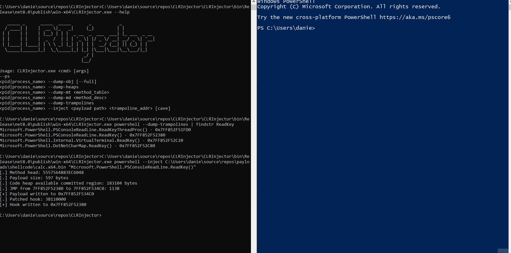

## Disclaimer

This tool is provided for educational purposes only. Any actions and activities related to the material contained within this repository are solely your responsibility. Misusing this tool can result in criminal charges against the persons in question. The author will not be held responsible if any criminal charges are brought against any individuals misusing the provided tool to break the law.

## What is this?

A proof-of-concept process injection tool that mixes Adam Chester's ([@XPN](https://twitter.com/_xpn_)) "Weird Ways to Run Unmanaged Code in .NET" and Ceri Coburn's ([@_EthicalChaos_](https://twitter.com/_ethicalchaos_)) "Needles Without The Thread: Threadless Process Injection - Ceri Coburn".

## How does it work?

* List target processes
```
CLRInjector.exe --ps
```
* Dump GC heap (similar to SOS.dll !dumpheap)
```
CLRInjector.exe <pid|process_name> --dump-obj
```
* Dump method tables (similar to SOS.dll !dumpmt)
```
CLRInjector.exe <pid|process_name> --dump-mt 0x1122334455667788
```
* Dump method descriptor (similar to SOS.dll !dumpmd)
```
CLRInjector.exe <pid|process_name> --dump-md 0x1122334455667788
```
* Dump trampolines (injection targets)
```
CLRInjector.exe <pid|process_name> --dump-trampolines
```
* Hook Jitted method and loads shellcode into preexisting RWX segment
```
CLRInjector.exe <pid|process_name> --inject <payload path> <method_desc>
```

### Usage example



## Known issues

* To reserve space for the shellcode, the tool updates the JIT Manager loader code heap m_pAllocPtr. This keeps future JIT allocations from overwriting the payload. There is a chance of a race condition if m_pAllocPtr is updated by the JIT manager after its read but before its patched by the tool.
* For now, the shellcode must support being called as a function and return, otherwise it may crash the target process. A generic stub that loads the shellcode on its own thread would most likely solve this.

## References

* https://blog.xpnsec.com/weird-ways-to-execute-dotnet/
* https://www.youtube.com/watch?v=z8GIjk0rfbI&t=1388s
* https://learn.microsoft.com/en-us/archive/msdn-magazine/2005/may/net-framework-internals-how-the-clr-creates-runtime-objects
* https://www.codeproject.com/articles/37549/clr-injection-runtime-method-replacer?fid=1542682&df=90&mpp=25&prof=True&sort=Position&view=Normal&spc=Relaxed&fr=26
* https://blog.maartenballiauw.be/post/2017/01/03/exploring-.net-managed-heap-with-clrmd.html
* https://mattwarren.org/2016/09/06/Analysing-.NET-Memory-Dumps-with-CLR-MD/

## Todo

PRs are always welcome!

- [ ] Support to x86 targets
- [ ] Generic shellcode support
- [ ] Migrate p/invoke calls to d/invoke
- [ ] Cleanup code
- [x] Support real slot in MethodTable
